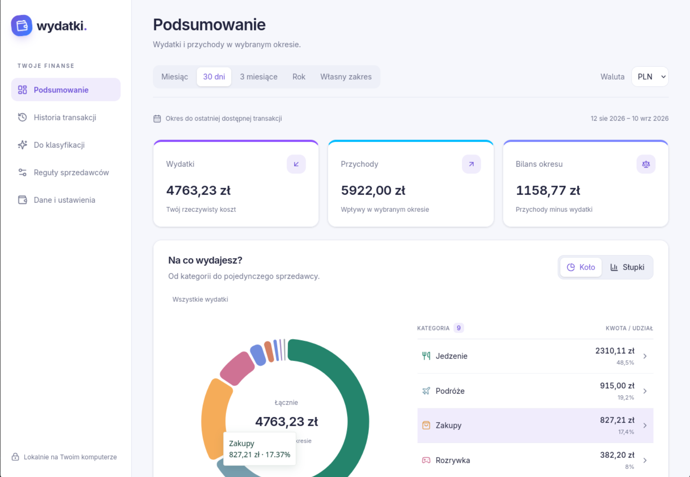

# Expense Tracker (Wydatki)

Aplikacja do śledzenia wydatków na podstawie wyciągów z banku. Została zaprojektowana tak, aby automatyzować kategoryzację i rozwiązywać codzienne problemy z analizą finansów – od rozliczeń ze znajomymi, po transfery między własnymi kontami.

## Główne funkcje

* **Automatyczna kategoryzacja:** Aplikacja sama proponuje i przypisuje kategorie do nowych transakcji.
* **Reguły sprzedawców:** Możesz zapamiętać własne przypisania. Przykładowo, możesz ustawić, że płatności w "KufleKapsle" będą zawsze automatycznie przypisywane do kategorii *Restauracje i dostawy*.
* **Grupowanie transakcji (rozliczenia ze znajomymi):** Koniec z fałszywym zawyżaniem wpływów i wydatków. Kiedy zapłacisz 100 zł za pizzę, a od znajomych dostaniesz dwa przelewy BLIK po 33 zł, możesz złączyć te operacje w jedną grupę. Aplikacja potraktuje to jako jeden, rzeczywisty wydatek na kwotę 34 zł.
* **Wsparcie AI:** Algorytmy potrafią automatycznie sugerować, które transakcje z wyciągu warto połączyć w takie grupy.
* **Inteligentne transfery własne:** Kategoria *Transfer między własnymi kontami* nie wlicza się ani do wydatków, ani do wpływów. Dzięki temu przelanie np. 5000 zł z banku A do banku B (z których oba mają wgrane wyciągi) nie zaburzy Twoich miesięcznych podsumowań.

## Prywatność i dane

* **Lokalna baza danych:** Wszystko zostaje u Ciebie. Aplikacja przechowuje całą historię finansową, wyciągi i konfigurację lokalnie, w plikowej bazie danych w jednym folderze. Nigdzie nie wysyła Twoich wyciągów.
* **Funkcje AI:** Do korzystania z funkcji automatycznego sugerowania grup potrzebny jest własny klucz API (OpenAI). Jeśli go nie podasz, aplikacja nadal będzie działać, a transakcje możesz grupować ręcznie.

## Podgląd aplikacji



## Budowanie wersji Linux

Aby lokalnie zbudować samodzielny plik dla bieżącej architektury Linuksa, uruchom:

```bash
scripts/build_linux.sh
```

Wynikiem będzie `dist/Wydatki`. Skrypt wydaniowy na GitHubie używa tego samego mechanizmu i dołącza program, ikonę oraz instalator do paczki.
